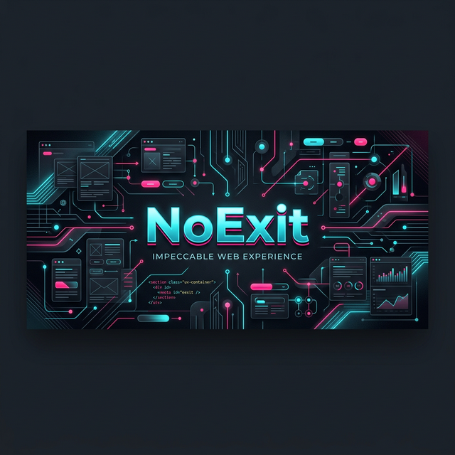

<div align="center">
  

  <h1>NoExit</h1>
  <p>Impeccable Web Experience & Futuristic UI/UX</p>

  <p>
    <a href="https://react.dev/"></a>
    <a href="https://threejs.org/"></a>
    <a href="https://tailwindcss.com/"></a>
    <a href="https://vitejs.dev/"></a>
  </p>
</div>

## 📌 Visão Geral

**NoExit** é uma vitrine de excelência em desenvolvimento Frontend. Projetado sob a ótica de uma experiência de usuário (UX) impecável, este projeto traz uma interface imersiva, minimalista e futurista, focada em animações fluídas, contrastes modernos (Dark Mode) e altíssima performance.

Não se trata apenas de uma aplicação, mas de um estudo profundo sobre **Design de Interação**, **Microinterações** e **Estética Web Contemporânea**.

## 🚀 Principais Destaques

- **Design Impecável e Futurista:** Paleta de cores neon contrastando com fundos escuros profundos (Cyberpunk / Modern Dark Mode).
- **Integração 3D & WebGL:** Uso de tecnologias gráficas avançadas (Three.js) para criar cenários dinâmicos que reagem à navegação do usuário.
- **Animações e Transições Mágicas:** Coreografia visual completa usando bibliotecas de ponta para garantir 60FPS constantes (Framer Motion / CSS moderno).
- **Totalmente Responsivo:** Layout adaptável para dispositivos móveis, tablets e telas ultrawide, sem perda de fidelidade gráfica.
- **Arquitetura Baseada em Componentes:** Código React perfeitamente encapsulado, limpo e reutilizável.
- **Build Otimizado:** Processamento em tempo real através do ecossistema moderno e rápido do Vite.

## 📂 Visão Técnica & Estrutura

Ao acessar o sistema, os usuários são recebidos por um hero-banner animado e elementos de interface vitrificada (Glassmorphism), criando uma sensação imediata de profundidade. As interações, cliques e rolagens são cuidadosamente roteirizadas para responder sem atraso, entregando o famoso "efeito wow" na primeira impressão.

## 🛠️ Tecnologias de Interface

- **Core:** JavaScript/TypeScript (ES6+), HTML5 Semântico.
- **Ecossistema UI:** React.js, TailwindCSS.
- **Engenharia Gráfica:** Three.js / WebGL.
- **Ferramentas de Desenvolvimento:** Vite.js, Node.js.

## ⚙️ Como Executar Localmente

Quer rodar esta experiência na sua máquina? É simples:

1. Clone este repositório
   ```bash
   git clone https://github.com/gabsprogrammer/noexit.git
   ```
2. Acesse a pasta
   ```bash
   cd noexit
   ```
3. Instale as dependências
   ```bash
   npm install
   ```
4. Inicie o servidor de desenvolvimento ultra-rápido
   ```bash
   npm run dev
   ```
5. Acesse no navegador o link indicado no console (geralmente `http://localhost:5173`).

## 👨‍💻 O Arquiteto UI/UX

**Gabriel Santana**  
Desenvolvedor Fullstack | [GitHub](https://github.com/gabsprogrammer) | [LinkedIn](https://linkedin.com)
